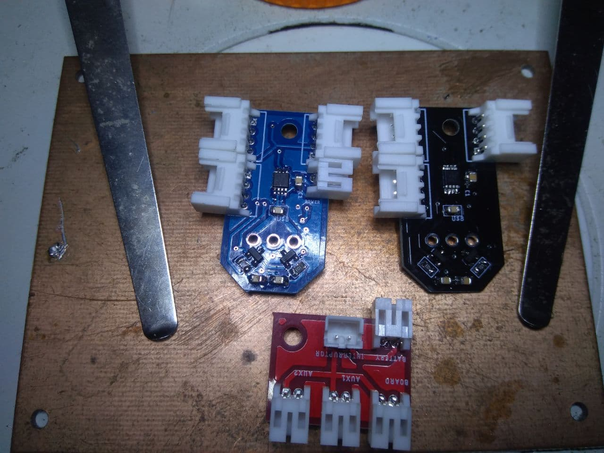

# Pic_Motor_encoder
I2C controlled servo

 
 **ServoMotor detail of the interior circuit** 
 
The servomotor consists of a controller board with a PIC16f1503 and a LB1938FA driver, which drive a Pololu &quot;Micro-metal-gearmotors&quot; type reduction motor. The reduction of the motors is based on the need for example:

- 100: 1, 130 rpm
- 298:1, 45 rpm

The microcontroller communicates through I2C, which allows us to connect 127 nodes in series. There will not be so many in our applications, we have asked for LP motors, Low power because they have a low consumption that allows us to connect them in series.

The I2c address will depend on the application that we are going to make, it should not be a problem to change it depending on the needs, but we are going to give a few premises. The I2C addresses are defined by 7 bits, the least significant bit tells us if it is writing or reading, so we will give a couple of addresses, the first is the one recorded in the pic, and the other is the one we will use in the Arduino / teensy to communicate. Always in Hexadecinal.

- Servomotor right 0x20 --> 0x10
- Servomotor left 0x22 --> 0x11

### Driver

The driver is [LB1938FA](https://www.dropbox.com/s/l5har1ai8nknbxs/LB1938FA.pdf?dl=0), It is a driver configured in H-bridge that allows us to control the motor in speed and direction with only two inputs. Analyzing the driver that the DFRobot servomotors carry, the L9110S looks for alternatives because the aforementioned driver is a little out of print or is only sold on pages of doubtful reliability.

 

 **LB1938FA is the cousin of the L9110S carried by Dfrobotics servos.** 

#### The inputs IN1 and IN2 of the driver are the RC5 and RC3 outputs of the PIC16f1503 respectively that can operate as PWM1 and PWM2.

####

### Software

 
 
 **Detail of the motor control board** 

The same board can serve different purposes, for example, in the robotic arm we need positioning and hold, while the Eco\_robot we are interested in speed. For this reason and everything that the program is going to be very similar we will have to make different versions. Or group them all in one, although I am afraid that the memory of the PI16f1503 (2Kwords) is not going to give that much.

The encoder gives 12 points per turn, which must be multiplied by the reduction to know how many pulses per turn they give.

If you need more powerful motors or those that require a greater workload, there is a version of these servos with an independent power supply from the motors.
